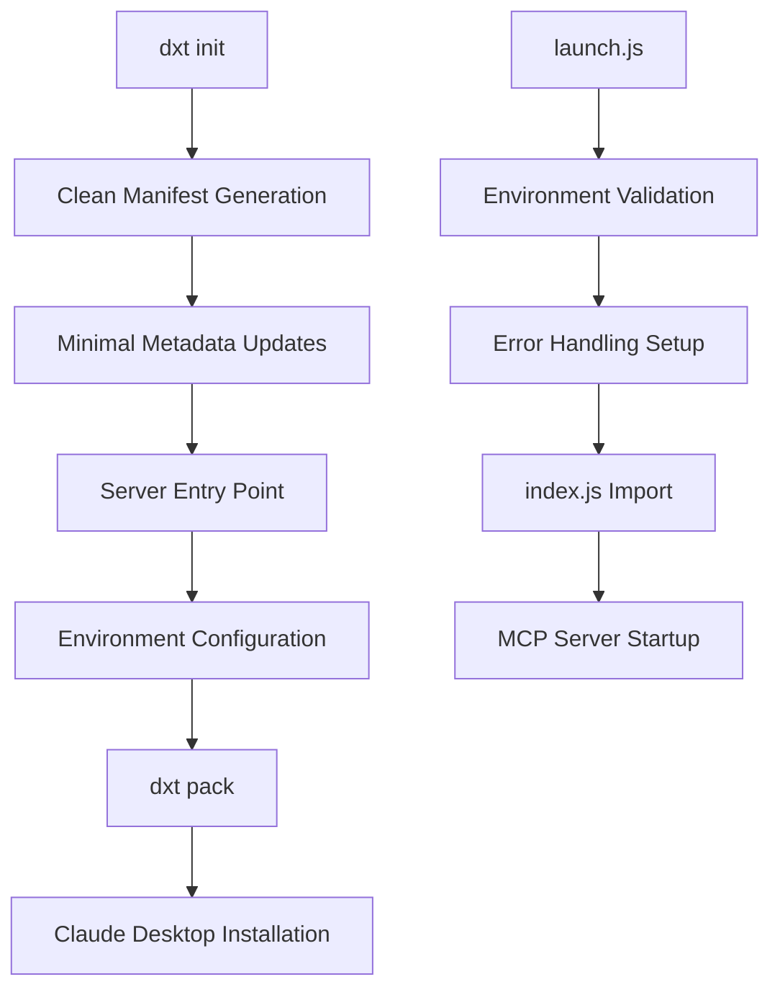

# Design Document

## Overview

This design addresses the Claude Desktop extension packaging issues for the Linear MCP server by implementing a clean separation between dxt manifest generation and server configuration. The solution focuses on using dxt's native manifest structure while handling all custom configuration through the entry point script.

## Architecture

### Current Problem Analysis

The current manifest.json contains conflicting server configuration keys:
- `entry_point` vs `entry` 
- `mcp_config` object alongside direct server keys
- `useBuiltInNode`, `command`, `args`, `env`, `timeout` keys that may not be supported by dxt schema

### Solution Architecture



## Components and Interfaces

### 1. Manifest Management

**Clean Manifest Structure**
- Use only dxt-generated keys
- Minimal metadata customization (name, id, description, version)
- Single entry point reference: `server/launch.js`

**Rejected Approach**: Manual server configuration in manifest
**Chosen Approach**: Configuration through entry point script

### 2. Entry Point Architecture

**launch.js (Entry Point)**
- Environment variable validation and logging
- Process lifecycle management
- Error handling setup
- Graceful degradation for missing tokens

**index.js (MCP Server)**
- Existing LinearServer implementation
- Enhanced warmup logging
- Improved error handling

### 3. Environment Configuration

**Supported Variables**:
- `LINEAR_ACCESS_TOKEN` (primary, for Claude Desktop)
- `LINEAR_API_KEY` (fallback, for development)

**Configuration Flow**:
1. Claude Desktop extension settings → `LINEAR_ACCESS_TOKEN`
2. launch.js validates and logs token presence
3. index.js reads token during warmup
4. Graceful handling if token missing

### 4. Build Process

**Clean Build Workflow**:
1. Delete existing manifest.json
2. Run `dxt init` with minimal prompts
3. Update only metadata fields (name/id/description)
4. Copy built server files to dist/claude-extension/server/
5. Run `dxt pack`

## Data Models

### Manifest Schema (dxt-compliant)
```json
{
  "dxt_version": "0.1",
  "name": "linear-mcp-server",
  "version": "1.0.0", 
  "description": "Linear MCP server for Claude Desktop",
  "author": {
    "name": "Linear MCP Team"
  },
  "server": {
    "type": "node",
    "entry_point": "server/launch.js"
  },
  "license": "MIT"
}
```

### Environment Configuration
```typescript
interface EnvironmentConfig {
  LINEAR_ACCESS_TOKEN?: string;  // Primary token for Claude Desktop
  LINEAR_API_KEY?: string;       // Fallback for development
}
```

### Build Configuration
```typescript
interface BuildConfig {
  sourceDir: string;           // 'build/'
  targetDir: string;          // 'dist/claude-extension/server/'
  entryPoint: string;         // 'server/launch.js'
  manifestPath: string;       // 'dist/claude-extension/manifest.json'
}
```

## Error Handling

### 1. Manifest Validation Errors
- **Detection**: dxt pack command fails with schema errors
- **Resolution**: Regenerate manifest using dxt init
- **Prevention**: Avoid manual manifest editing

### 2. Missing Authentication
- **Detection**: No LINEAR_ACCESS_TOKEN or LINEAR_API_KEY
- **Handling**: Log warning, continue server startup
- **User Experience**: Tools return authentication errors with helpful messages

### 3. Server Startup Failures
- **Detection**: Uncaught exceptions during initialization
- **Handling**: launch.js catches and logs errors
- **Recovery**: Process stays alive briefly for log collection

### 4. Warmup Timeout
- **Detection**: ensureWarm() timeout exceeded
- **Handling**: Continue with unauthenticated state
- **Logging**: Clear timeout warnings

## Testing Strategy

### 1. Manifest Validation Testing
```bash
# Test clean manifest generation
cd dist/claude-extension
rm manifest.json
npx -y @anthropic-ai/dxt init
# Verify no schema errors
npx -y @anthropic-ai/dxt pack
```

### 2. Environment Variable Testing
- Test with LINEAR_ACCESS_TOKEN set
- Test with LINEAR_API_KEY set  
- Test with no token (graceful degradation)
- Test with invalid token (error handling)

### 3. Claude Desktop Integration Testing
- Install generated .dxt file
- Configure LINEAR_ACCESS_TOKEN in extension settings
- Verify server startup logs
- Test basic Linear API calls

### 4. Build Process Testing
- Test complete rebuild from scratch
- Verify file copying and permissions
- Test packaging with different metadata

## Implementation Phases

### Phase 1: Clean Manifest Generation
1. Create build script for clean manifest generation
2. Update package.json with build commands
3. Test dxt init/pack workflow

### Phase 2: Enhanced Entry Point
1. Improve launch.js logging and error handling
2. Add environment variable validation
3. Enhance process lifecycle management

### Phase 3: Build Automation
1. Create automated build script
2. Add file copying and permission handling
3. Integrate with existing npm scripts

### Phase 4: Documentation and Testing
1. Update README with new build process
2. Create troubleshooting guide
3. Add integration test scripts

## Security Considerations

### Token Handling
- Tokens configured through Claude Desktop settings (secure)
- No tokens stored in manifest or source code
- Graceful handling of missing/invalid tokens

### Process Security
- Minimal process permissions required
- Error logging doesn't expose sensitive data
- Clean process shutdown on SIGINT

## Performance Considerations

### Startup Performance
- Asynchronous warmup doesn't block MCP initialization
- Timeout prevents hanging on authentication failures
- Minimal logging overhead

### Runtime Performance
- No impact on existing MCP tool performance
- Environment variable reading cached during warmup
- Error handling doesn't impact normal operation